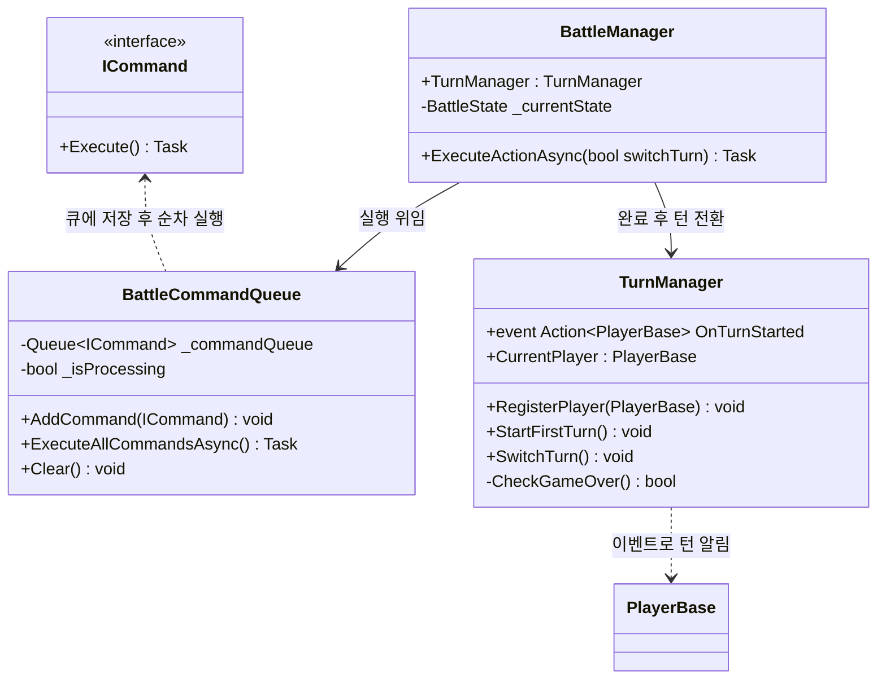
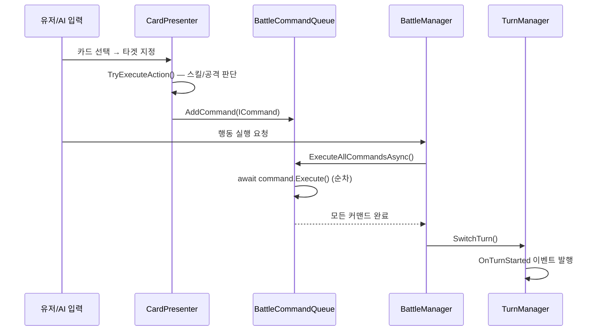
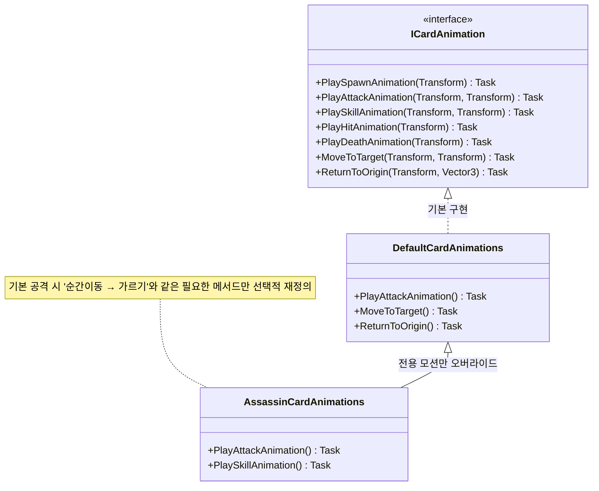
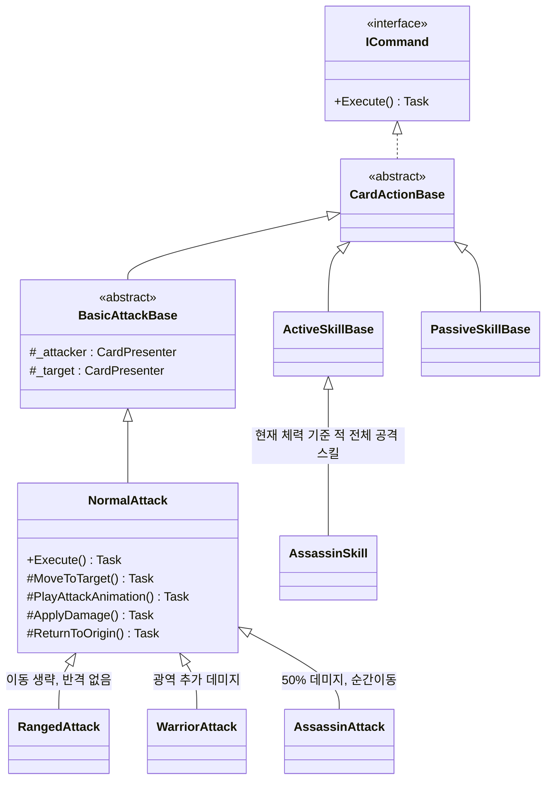
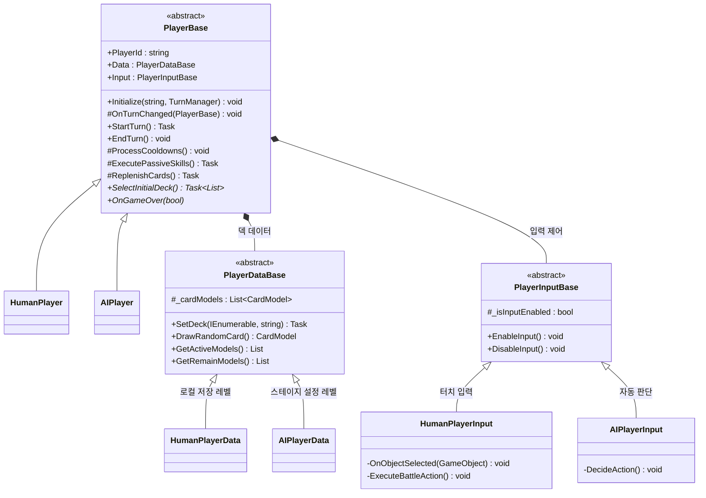
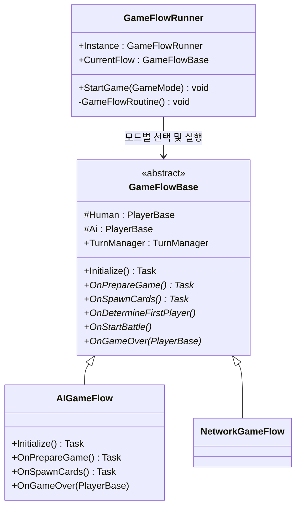

# 1. 프로젝트 개요
* **개발 환경**: Unity 6000.4.3f1 / Android (세로형)


---


# 2. 구현 기능 목록
* [필수 구현 사항 기능]
* **신규 카드 "암살자" 추가**
  * 기본 공격: 체력의 절반 피해
  * 스킬 공격: 적 전체 체력 피해
* 카드 획득 및 성장 시스템
* 카드 전투 애니메이션 및 데미지 텍스트
* Addressables(어드레서블)을 통한 리소스 관리

---


# 3. AI 도구 및 리소스 활용 출처

* **AI 도구**: Gemini CLI, Antigravity
  * 활용 범위: 코드 전반적인 설계와 기능 제작, 리팩토링
* **AI 생성 리소스**: Google Flow
  * 활용 범위: 인게임 내 전체 아트/UI 리소스 제작
* **외부 서드파티 에셋**: DoTween


---


# 4. 주요 코드 구조 설명

## 1. 커맨드 기반의 배틀 진행 보장과 턴 변경

### 설계 의도
카드 배틀에서 공격, 스킬, 힐 등 모든 행동은 **순서가 보장**되어야 하고, 각 행동의 **연출(애니메이션)이 완전히 끝난 후** 다음 행동이 실행되어야 합니다. 이를 위해 행동 자체를 객체화하는 **Command Pattern**과 비동기 Queue를 결합했습니다.

### 적용 패턴
- **Command Pattern** — 모든 행동을 `ICommand` 인터페이스로 캡슐화
- **Observer Pattern** — `TurnManager`의 `OnTurnStarted` 이벤트로 턴 변경을 전파

### 구조



### 실행 흐름



### 이 설계를 선택한 이유
| 관점 | 설명 |
|------|------|
| **확장성** | 새 스킬 추가 시 `ICommand` 구현 클래스 하나만 작성. 기존 `BattleManager`, `TurnManager` 코드 수정 불필요 |
| **안정성** | Queue(FIFO) + `async/await`로 행동의 실행 순서와 연출 완료가 구조적으로 보장됨 |
| **결합도** | `BattleManager`는 구체적 스킬 로직을 알지 못하고, `ICommand.Execute()`만 호출하여 완전 분리 |
| **유연성** | `TurnManager.OnTurnStarted` 이벤트를 구독하면 어떤 시스템이든 턴 변경에 자유롭게 반응 가능 |

---

## 2. MVP 구조의 카드 시스템 — 애니메이션과 공격 로직의 다형성

### 설계 의도
카드마다 공격 방식(근접/원거리/어쌔신)과 애니메이션이 다릅니다. 이 차이를 조건문 분기가 아닌 **다형성**을 통해 새 카드 직업군 추가 시 기존 코드에 영향을 최소화하도록 고려했습니다.

### 적용 패턴
- **MVP (Model-View-Presenter)** — 데이터, 연출, 제어 로직의 3계층 분리
- **Strategy Pattern** — `ICardAnimation` 인터페이스로 직업별 애니메이션 교체
- **Template Method Pattern** — `NormalAttack`이 공격 골격을 정의하고 하위 클래스가 단계별 오버라이드
- **Flyweight Pattern** — `CardData`(ScriptableObject)를 통한 카드 고유의 정적 데이터 공유

### MVP 계층 구조

```
┌──────────────────────────────────────────────────────┐
│  CardData (ScriptableObject) — Flyweight             │
│  불변 데이터: 이름, 타입, 스킬키, 레벨별 스탯 테이블    │
│  에디터에서 기획자가 코드 수정 없이 밸런스 조정 가능      │
└───────────────┬──────────────────────────────────────┘
                │ 참조
┌───────────────▼──────┐  이벤트 구독  ┌───────────────────┐
│  CardModel (Model)   │◄────────────►│ CardPresenter (P)  │
│  순수 C# 클래스       │              │  Model↔View 중재   │
│  HP, 쿨다운, 생존 상태│              │  스킬 판정 및       │
│  OnHpChanged 이벤트  │              │  커맨드 생성        │
└──────────────────────┘              └────────┬──────────┘
                                               │ 제어
                                      ┌────────▼──────────┐
                                      │  CardView (View)  │
                                      │  ICardAnimation   │
                                      │  으로 카드별       │
                                      │ 애니메이션 연출 위임 │
                                      └───────────────────┘
```

### 애니메이션 전략 교체 (Strategy Pattern)



### 공격 로직의 다형성 (Template Method)

`NormalAttack.Execute()`가 **이동 → 모션 → 데미지 → 복귀** 4단계 골격을 정의합니다.  
하위 클래스는 필요한 단계만 `override`하여 공격 방식을 변경합니다.



**각 하위 클래스의 오버라이드 전략:**

| 클래스 | 이동 | 공격 모션 | 데미지 공식 | 반격 | 복귀 |
|--------|:----:|:--------:|:----------:|:----:|:----:|
| `NormalAttack` | ✅ 대상 앞 | ✅ 기본 | HP 100% | ✅ | ✅ |
| `RangedAttack` | ❌ 제자리 | ✅ 흔들림 | HP 100% | ❌ | ❌ |
| `WarriorAttack` | ✅ | ✅ | HP 100% + 인접 50% | ❌ | ✅ |
| `AssassinAttack` | ❌ (모션 내 처리) | ✅ 가르기 | HP **50%** | ✅ | ✅ |

### 이 설계를 선택한 이유
| 관점 | 설명 |
|------|------|
| **데이터 주도** | `CardData`(SO)에서 밸런스를 수정 가능하며, AniamtionKey 값 변경을 통해 실행되는 애니메이션 변경 가능 |
| **직업 확장** | 새 직업(마법사 등) 추가 시 `XxxAttack` + `XxxCardAnimations` 2개 클래스만 작성하여 동작 분리 |
| **메모리 효율** | Flyweight 패턴으로 같은 카드 10장이어도 `CardData`(SO)는 메모리에 1개만 로드 |

---

## 3. 플레이어 객체별 데이터 분리 및 독립적 동작 판단

### 설계 의도
사람은 화면을 터치하고, AI는 알고리즘으로 판단합니다. 카드 레벨도 유저는 로컬 저장소, AI는 스테이지 설정에서 가져옵니다. 이 차이를 **하나의 일관된 추상 클래스(`PlayerBase`)** 아래에서 독립적으로 처리하도록 구상

### 적용 패턴
- **Mediator Pattern** — `PlayerBase`가 플레이어별 Data, Input, TurnManager 간의 모든 통신을 중재
- **Strategy Pattern** — 입력 방식(`PlayerInputBase`)과 데이터 소싱(`PlayerDataBase`)을 교체 가능한 전략으로 분리

### 구조



### 턴 시작 시 자동 실행되는 내부 파이프라인

```
TurnManager.OnTurnStarted 이벤트 수신
    └─ PlayerBase.OnTurnChanged()
        ├─ 자신의 턴인지 확인
        ├─ ProcessCooldowns()       ← 모든 카드 스킬 쿨다운 -1
        ├─ ExecutePassiveSkills()   ← 패시브 조건 체크 및 자동 발동
        ├─ ReplenishCards()         ← 빈 슬롯에 예비 카드 보충
        └─ Input.EnableInput()
            ├─ [Human] → 터치 이벤트 구독, 유저 입력 활성화
            └─ [AI]    → 즉시 전투 가능 카드 파악 후 이벤트 전달. 1초 딜레이 후 자동 행동
```

### 초기 사용자의 카드 데이터 선택 방식

| | `HumanPlayerData` | `AIPlayerData` |
|---|---|---|
| **레벨 결정** | `PlayerData.GetCardLevel()` — 유저 세이브 데이터 | `GameInformation.CurrentStageMonsters` — 스테이지 설정에 따른 데이터 |
| **덱 선택** | UI(`InGameDeckSelectUI`)를 통한 직접 선택을 위해 비동기 방식으로 대기 | `GameInformation.AiDeck`에서 자동 상위 3장 선택 |

### 이 설계를 선택한 이유
| 관점 | 설명 |
|------|------|
| **다형성 활용** | `TurnManager`는 `PlayerBase` 타입만 다루므로, 사람/AI 구분 없이 동일한 턴 전환 로직으로 동작 |
| **입력 교체** | 플레이어에 따른 새 입력 방식은 `PlayerInputBase` 상속 클래스 추가만으로 대응 가능 |
| **데이터 독립** | 같은 카드 데이터라도 유저는 Lv.5, AI는 Lv.2 등 소유자별 서로 다른 카드 데이터 적용 가능 |
| **단일 책임** | `PlayerBase`(흐름), `Data`(카드 정보), `Input`(사용자 입력) — 각각 한 가지 책임만 담당하여 변경 영향 최소화 |

---

## 4. 독립된 게임 흐름 관리를 위한 흐름 관리자

### 설계 의도
AI 대전, 네트워크 대전 등 게임 모드마다 초기화/덱 선택/보상 지급 로직이 다릅니다. 이것을 하나의 클래스에 모으면 `if(mode == ...)` 분기가 곳곳에 생기므로, **모드별 전략 클래스**로 분리하고 실행 순서는 **템플릿 메서드**로 강제했습니다.

### 적용 패턴
- **Strategy Pattern** — `GameFlowRunner`가 모드에 따라 적합한 `GameFlowBase` 구현체를 동적 선택
- **Template Method Pattern** — `GameFlowBase`가 생명주기 순서를 추상 메서드로 정의, 실행 순서를 `GameFlowRunner`가 고정

### 구조



### 고정된 생명주기

```
GameFlowRunner.GameFlowRoutine() 이 강제하는 실행 순서:
━━━━━━━━━━━━━━━━━━━━━━━━━━━━━━━━━━━━━━━━━━━━━━━━━━━━
  1. await Initialize()            ← 플레이어, 턴매니저 생성
  2. await OnPrepareGame()         ← 덱 로드 및 선택 대기
  3. await OnSpawnCards()          ← 필드에 카드 배치
  4. OnDetermineFirstPlayer()      ← 선공 결정
  5. OnStartBattle()               ← 전투 루프 시작
  ─── 전투 진행 중 ───
  6. OnGameOver(loser)             ← 종료 처리, 보상 지급
```

### 이 설계를 선택한 이유
| 관점 | 설명 |
|------|------|
| **초기화 순서 보장** | `GameFlowRoutine()`이 호출 순서를 강제하므로 "초기화 전에 전투 시작" 같은 구조적 버그 최소화 |
| **비동기 대기** | 모든 단계가 `async Task`를 통한 비동기 대기로 "초기화 - 실행" 순서를 보장 |
